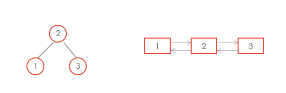

# 二叉搜索树与双向链表

## 题目描述

输入一棵二叉搜索树，将该二叉搜索树转换成一个排序的双向链表。要求不能创建任何新的结点，只能调整树中结点指针的指向。



## 解题思路

```java
private TreeNode pre = null;
private TreeNode head = null;

public TreeNode Convert(TreeNode root) {
  inOrder(root);
  return head;
}

private void inOrder(TreeNode node) {
  if(node == null) {
    return;
  }
  inOrder(node.left);
  node.left = pre;
  if(pre != null) {
    pre.right = node;
  }
  pre = node;
  if(head == null) {
    head = node;
  }
  inOrder(node.right);
}
```