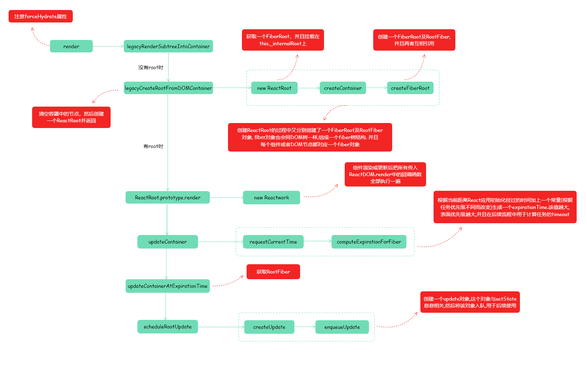

# React源码阅读

这是 React 源码阅读的第三篇文章，有以下几点事项需要注意以下：

+ 目前阅读的 <b>React 版本为 16.13.0</b>
+ 需要辅以练习代码，在结合理解进行阅读，这样对理解react源码的帮助有所提升。
+ 文中提到的源码  均以 dev 环境下的源码, 可自行 yarn 对应包查看。

以下是阅读 React 源码的 流程：


## ReactRoot.prototype.render

在上一篇中，介绍了当 ReactDOM.render执行时，内部会首先判断是否存在root，没有的话会去创建一个root，在这篇文章中，将会了解到 存在root后会发生什么事情

```javascript
function legacyRenderSubtreeIntoContainer(
  parentComponent,
  children,
  container,
  forceHydrate,
  callback
) {
  var root = container._createRootContainer;
  var fiberRoot;
  // ...省略部分代码
  unbatchedUpdate(function() {
    updateContainer(children, fiberRoot, parentComponent, callback);
  })
}
```

在上述的代码中调用了 `unbatchedUpdates`函数，这个函数涉及到的知识在React中相当重要。

都知道 setState 一起执行，并不会触发React的多次渲染

```
// age会变成3，但是不会触发三次渲染
this.setState({age: 1})
this.setState({age: 2})
this.setState({age: 3})
```
这是因为内部将这三次setState优化为一次更新，术语是批量更新(batchUpdate)，在后续的内容中也可以看到内部是如何处理批处理更新的。

对于root来说其实没必要去批量更新，所以这里调用了 `unbatchedUpdates`函数来告知内部不需要批量更新。

接下来解析下`unbatchedUpdates`函数的执行

```javascript
// 实际上该函数是一种强制同步更新的方法.
// 处理传入函数的executionContext上下文

function unbatchedUpdates(fn, a) {
  var prevExecutionContext = executionContext;
  
  // 这里要将LegacyUnbatchedContext类型合并到当前上下文
  // 在方法执行完后恢复之前的执行环境, 以同步的形式
  executionContext &= ~BatchedContext;
  executionContext |= LegacyUnbatchedContext;

  try {
    return fn(a);
  } finally {
    executionContext = prevExecutionContext;
    if (executionContext === NoContext) {
      flushSyncCallbackQueue();
    }
  }
}
```

接下来看下 `updateContainer`内部是怎么执行的。

```javascript
// 计算过期时间 -> 创建更新的update对象 -> 加入到调度队列 -> 开启任务调度
function updateContainer(
  element,
  container,
  parentComponent,
  callback
) {
  // 获取root上的根fiber对象
  var current$1 = container.current;
  
  // 获取当前的时间节点
  var currentTime = requestCurrentTimeForUpdate();
  
  var suspenseConfig = requestCurrentSuspenseConfig();
  // 计算当前的到期时间
  var expirationTime = computeExpirationForFiber(
    currentTime,
    current$1,
    suspenseConfig
  );
  // 省略部分代码
}
```

首先从FiberRoot的current属性中取出它的fiber对象，然后计算了两个时间，这两个时间很重要，需要单独列出来描述。

## 时间

首先是currentTime，调用了`requestCurrentTimeForUpdate`函数

```javascript
var currentEventTime = NoWork; // 0

function requestCurrentTimeForUpdate() {
  if ((executionContext & (RenderContext | CommitContext)) !== NoContext) {
    // 执行的上下文的render或commit,在执行阶段获取真实时间
    return msToExpirationTime(now());
  }

  // 如果没在react内部更新中,可能是在执行浏览器的任务中
  if (currentEventTime !== NoWork) {
    return currentEventTime;
  }

  // 之前的任务已经执行完,开启新的任务时候需要重新计算时间
  currentEventTime = msToExpirationTime(now());
  return currentEventTime;
}
```

now() 就是 performance.now()，这里有对该API的详细介绍[相关文档](https://developer.mozilla.org/zh-CN/docs/Web/API/Performance/now)，得到的结果就是 现在离 React 应用初始化时经过了多少时间。

然后需要把计算出来的值再通过一个公式算一遍，这里的 `| 0`作用是取整数。

```javascript
var MAX_SIGNED_31_BIT_INT = 1073741823;
var Sync = MAX_SIGNED_31_BIT_INT;
var Batched = Sync - 1;
var UNIT_SIZE = 10;
var MAGIC_NUMBER_OFFSET = Batched - 1; 

function msToExpirationTime(ms) {
  return MAGIC_NUMBER_OFFSET - (ms / UNIT_SIZE | 0);
}
```

接下来就假定一些变量值，带入公式计算方便理解。

假设当前时间2500，也就是说当前距离React应用初始化已经2500毫秒了，最后通过公式得到的结果为：

```
currentTime = 1073741822 - ((2500 / 10) | 0) = 1073741572
```

接下来计算 expirationTime，<b>这个时间和优先级有关，值越大，优先级越高</b>。并且同步是优先级最高的，它的值为 1073741823，也就是之前看到的常量 MAGIC_NUMBER_OFFSET  + 1。

在 `computeExpirationForFiber` 函数中存在很多分支，但是计算的核心在三行代码上，分别是:

```javascript
// 同步
expirationTime = Sync
// 交互事件，优先级较高
expirationTime = computeInteractiveExpiration(currentTime);
// 异步，优先级较低
expirationTime = computeAsyncExpiration(currentTime)
```

接下来就来分析 `computeInteractiveExpiration`函数内部是如何计算时间的，当然 `computeAsyncExpiration`计算时间的方式是相同的，无非换了两个变量。

```javascript
var HIGH_PRIORITY_EXPIRATION =  500 ;
var HIGH_PRIORITY_BATCH_SIZE = 100;
function computeInteractiveExpiration(currentTime) {
  return computeExpirationBucket(
    currentTime,
    HIGH_PRIORITY_EXPIRATION,
    HIGH_PRIORITY_BATCH_SIZE
  );
}

function computeExpirationBucket(
  currentTime,
  expirationInMs,
  bucketSizeMs
) {
  return
    MAGIC_NUMBER_OFFSET - 
    ceiling(
      MAGIC_NUMBER_OFFSET - currentTime + expirationInMs / UNIT_SIZE, 
      bucketSizeMs / UNIT_SIZE
    );
}

function ceiling(num, precision) {
  return ((num / precision | 0) + 1) * precision;
}
```

另外在ceiling函数中的 `1 * bucketSizeMs / UNIT_SIZE` 是为了抹平一段时间内的时间差，在抹平的时间差内不管有多少个任务需要自行，它们的过期时间都是同一个，这也算是一个性能优化，帮助渲染页面行为节流。

expirationTime指的就是一个任务的过期时间， React根据任务的优先级和当前时间来计算出一个任务的执行截止时间，只要这个值比当前时间大就可以一直让React延后这个任务的执行，以便让更高优先级的任务执行，但是一旦过了任务的截止时间，就必须让这个任务马上执行。

如果难以理解的话，就需要记住 任务的过期时间是通过当前时间加上一个常量(任务优先级不同常量不同)计算出来的。

## createUpdate

当计算好expirationTime后，就会执行到 createUpdate函数来

```javascript
function updateContainer(
  element,
  container,
  parentComponent,
  callback
) {
  // ...省略部分源码
  // 生成update对象，是批处理更新的一个单元
  var update = createUpdate(expirationTime, suspenseConfig);
  
  // 为update对象具体要更新的参数赋值，传入的是ReactElement元素
  update.payload = { element: element };
  callback = callback === undefined ? null : callback;
  // 将update加入fiber根对象的任务队列
  enqueueUpdate(current$1, update)
  // 开始执行任务调度，在到期时间内;
  scheduleWork(current$1, expirationTime);
  return expirationTime;
}
```

首先会创建一个update，这个对象与setState有关联。

```javascript
function createUpdate(expirationTime, suspenseConfig) {
  var update = {
    // update对象的内部属性
    expirationTime: expirationTime,
    suspenseConfig: suspenseConfig,
    tag: UpdateState,
    // setState的第1,2参数
    payload: null,
    callback: null,
    // 用于在队列中找到下一个节点.
    next: null
  };
  update.next = update;
  return update;
}
```

对于 update 对象内部的属性来说，需要重点关注的是 next 属性，因为 update 其实就是一个队列中的节点，这个属性可以用于帮助寻找下一个update。对于批量更新来说，可能会创建多个update，因此需要将这些update串联并存储起来，在必要的时候拿出来用于更新state。

在render的过程中其实也是一次更新的操作，但是并没有setState，因此就把 payload 赋值为 {element}了。

接下来将callback 赋值给 update的属性，这里的callback 还是 ReactDOM.render的第三个参数。

然后将刚才创建出来的 update 对象插入队列中， `enqueueUpdate`函数内部分支较多，可自行前往查看，该函数的核心作用就是创建或者获取一个队列，然后把update对象入队。

最后调用 scheduleWork 函数，该部分属于调度相关的内容，在下一篇章详细解析。

## 总结

以上就是本文的全部内容，本文的核心还是放在了计算时间上，因为这个时间和后面的调度息息相关，最后通过一个流程图总结render流程：




