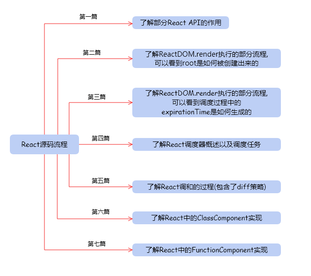
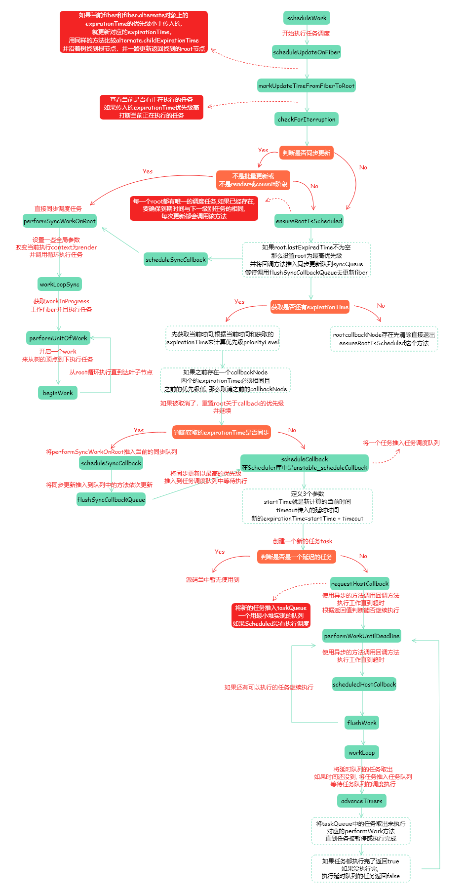

# React源码阅读

这是 React 源码阅读的第四篇文章，有以下几点事项需要注意以下：

+ 目前阅读的 <b>React 版本为 16.13.0</b>
+ 需要辅以练习代码，在结合理解进行阅读，这样对理解react源码的帮助有所提升。
+ 文中提到的源码  均以 dev 环境下的源码, 可自行 yarn 对应包查看。

以下是阅读 React 源码的 流程：




## 知识点

该篇主要分为两部分，讲述以下内容：

+ 调度器概述
+ React调度部分的源码解析


## 调度器

每次有新的更新任务发生时，调度器都会按照策略给这些任务分配一个优先级，比如动画的更新优先级会高点，离屏元素的更新优先级会低点。

通过这个优先级我们可以获取一个该更新任务必须执行的截止时间，优先级越高那么离截止时间就越接近，反之亦然。这个截止时间是用来判断该任务是否已经过期。如果过期就会马上执行该任务。

然后调度器通过实现 `requestIdleCallback` 函数来做到在浏览器空闲的时候去执行这些更新任务。

则其中的实现原理稍微复杂，简单来说，就是通过定时器的方式，来获取每一帧的结束时间。得到每一帧的结束时间后就能判断当下距离结束时间的一个差值。

如果还没到结束时间，那么就意味着可以继续执行更新任务，如果已经过了结束时间，那么意味着当前帧已经没有时间执行任务了，必须把执行权交还给浏览器，也就是打断任务的执行。

另外当开始执行更新任务(也就是寻找工作单元并执行的过程) 时，如果有新的更新任务进来，那么调度器就会按照两者优先级大小进行决策。如果新的任务优先级小，那么当然继续当下的任务；如果新的任务优先级大，那么会打断任务并开始新的任务。

## React调度源码解析

首先 setState 之后会触发 `enqueueSetState` 函数，创建了 update 之后会调用 `scheduleWork`，即调用`scheduleUpdateOnFiber`函数。

```javascript
function scheduleUpdateOnFiber(fiber, expirationTime) {
  // 判断是否是无限循环update
  checkForNestedUpdates();

  // 找到rootFiber并遍历更新子节点的expirationTime
  var root = markUpdateTimeFromFiberToRoot(fiber, expirationTime);
  if (root === null) {
    warnAboutUpdateOnUnmountedFiberInDEV(fiber);
    return;
  }
  
  // 判断是否有高优先级任务打断当前正在执行的任务
  checkForInterruption(fiber, expirationTime);
  
  // 报告调度更新(测试环境用)
  recordScheduleUpdate();
  
  var priorityLevel = getCurrentPriorityLevel();
  // 1073741823
  // 如果expirationTime等于最大整型值的话
  // 如果是同步任务的过期时间的话
  if (expirationTime === Sync) {
    // 如果还未渲染，update是未分批次的，也就是第一次渲染前
    if (
      (executionContext & LegacyUnbatchedContext) !== NoContext && 
      (executionContext & (RenderContext | CommitContext)) === NoContext
    ) {
      // 跟踪这些update，并计数，检测它们是否会报错
      schedulePendingInteractions(root, expirationTime);
      // 初始化root，调用 workLoop 进行循环单元更新
      performSyncWorkOnRoot(root);
    } else {
      // 立即执行调度任务
      ensureRootIsScheduled(root);
      schedulePendingInteractions(root, expirationTime);
      // 当前没有update时
      if (executionContext === NoContext) {
        // 刷新同步任务队列
        flushSyncCallbackQueue();
      }
    }
  } else { // 如果是异步任务的话，则立即执行调度任务
    ensureRootIsScheduled(root);
    schedulePendingInteractions(root, expirationTime);
  }
  
  if (
    (executionContext & DiscreteEventContext) !== NoContext &&
    // 只有在用户阻止优先级或更高优先级的更新才被视为离散，即使在离散时间中也是如此
    (priorityLevel === UserBlockingPriority$1 || 
      priorityLevel === ImmediatePriority)
  ) {
    // 这是离散事件的结果，跟踪每个根的最低优先级离散更新，以便可在需要时尽早清除它们
    // 如果 rootsWithPendingDiscreteUpdates 为null,则初始化它
    if (rootsWithPendingDiscreteUpdates === null) {
      // key是root,value是expirationTime
      rootsWithPendingDiscreteUpdates = new Map([[root, expirationTime]]);
    } else {
      // 获取最新的DiscreteTime
      var lastDiscreteTime = rootsWithPendingDiscreteUpdates.get(root);
      // 更新 DiscreteTime
      if (lastDiscreteTime === undefined
        || lastDiscreteTime > expirationTime
      ) {
        rootsWithPendingDiscreteUpdates.set(root, expirationTime);
      }
    }
  }
}
```

### checkForNestedUpdates()

作用：

+ 判断是否是无限循环的 update
+ 超过50成嵌套update，就终止进行调度，并报error
+ 造成死循环的原因: 在render()中无条件的使用 setState

```javascript
const NESTED_UPDATE_LIMIT = 50;
let nestedUpdateCount: number = 0;

function checkForNestedUpdates() {
  if (nestedUpdateCount > NESTED_UPDATE_LIMIT) {
    nestedUpdateCount = 0;
    rootWithNestedUpdates = null;
    {
      throw Error( "Maximum update depth exceeded. 
        This can happen when a component repeatedly calls setState inside componentWillUpdate or componentDidUpdate. 
        React limits the number of nested updates to prevent infinite loops." );
    }
  }
}
```

### markUpdateTimeFromFiberToRoot()

作用：找到rootFiber并遍历更新子节点的expirationTime

```javascript
// 目标fiber会向上寻找 rootFiber对象，在寻找的过程中会进行一些操作
function markUpdateTimeFromFiberToRoot(fiber, expirationTime) {

  // 如果fiber对象的过期时间小于expirationTime，则更新fiber对象的过期时间，也就是说，当前fiber的优先级是小于expirationTime的优先级的，现在要调高fiber的优先级
  if (fiber.expirationTime < expirationTime) {
    fiber.expirationTime = expirationTime;
  }

  // 与fiber.current是映射关系
  var alternate = fiber.alternate;
  if (alternate !== null && alternate.expirationTime < expirationTime) {
    alternate.expirationTime = expirationTime;
  }
  
  // 向上遍历父节点，直到root，在遍历的过程中更新子节点的expirationTime
  var node = fiber.return; // fiber的父节点
  var root = null;
  
  // 表示没有父节点了，也就是到达 RootFiber(最大父节点)
  // HostRoot 即树的顶端节点root
  if (node === null && fiber.tag === HostRoot) {
    // RootFiber的stateNode就是FiberRoot
    root = fiber.stateNode;
  } else { // 没有到达 FiberRoot的话，则进行循环
    while (node !== null) {
      alternate = node.alternate;
      // 如果父节点的所有子节点中优先级最高的更新时间仍小于expirationTime的话
      // 则提高优先级
      if (node.childExpirationTime < expirationTime) {
        // 重新赋值
        node.childExpirationTime = expirationTime;

        // alternate是相对于fiber的另一个对象，也要进行更新
        if (alternate !== null &&
          alternate.childExpirationTime < expirationTime
        ) {
          alternate.childExpirationTime = expirationTime;
        }
      } else if (alternate !== null &&
        alternate.childExpirationTime < expirationTime
      ) {
        alternate.childExpirationTime = expirationTime;
      }

      // 如果找到顶端rootFiber，结束循环
      if (node.return === null && node.tag === HostRoot) {
        root = node.stateNode;
        break;
      }
      node = node.return;
    }
  }

  // 更新该rootFiber的最旧，最新的挂起时间
  if (root !== null) {
    if (workInProgressRoot === root) {
      markUnprocessedUpdateTime(expirationTime);
      markRootSuspendedAtTime(root, renderExpirationTime$1);
      }
    }
    markRootUpdatedAtTime(root, expirationTime);
  }
  return root;
}
```

### checkForInterruption()

作用：判断是否有高优先级任务打断当前正在执行的任务

```javascript
function checkForInterruption(
  fiberThatReceivedUpdate,
  updateExpirationTime
) {
  // 如果任务正在执行，并且异步任务已经执行到一半了
  // 但是现在需要把执行权交给浏览器，去执行优先级更高的任务
  // 打断当前任务，优先执行新的update
  if ( workInProgressRoot !== null &&
    updateExpirationTime > renderExpirationTime$1
  ) {
    interruptedBy = fiberThatReceivedUpdate;
  }
}
```

### getCurrentPriorityLevel()

作用：获取当前调度任务的优先级

```javascript
// 除了90，用数字是因为这样做，方便比较
// 从90开始的原因是防止和Scheduler的优先级冲突
export const ImmediatePriority: ReactPriorityLevel = 99;
export const UserBlockingPriority: ReactPriorityLevel = 98;
export const NormalPriority: ReactPriorityLevel = 97;
export const LowPriority: ReactPriorityLevel = 96;
export const IdlePriority: ReactPriorityLevel = 95;
export const NoPriority: ReactPriorityLevel = 90;

// 获取当前调度任务的优先级
function getCurrentPriorityLevel() {
  switch (Scheduler_getCurrentPriorityLevel()) {
    case Scheduler_ImmediatePriority:
      return ImmediatePriority;
    case Scheduler_UserBlockingPriority:
      return UserBlockingPriority$1;
    case Scheduler_NormalPriority:
      return NormalPriority;
    case Scheduler_LowPriority:
      return LowPriority;
    case Scheduler_IdlePriority:
      return IdlePriority;
    default:
      throw Error( "Unknown priority level." );
  }
}
```

以上是同步任务第一次render的时候，接下来描述第二种情况。定位代码：

```javascript
function scheduleUpdateOnFiber(fiber, expirationTime) {
  // ...省略部分代码
  if (expirationTime === Sync) {
    if (第一次渲染) {
      // ...省略部分代码
    } else {
      ensureRootIsScheduled(root);
      schedulePendingInteractions(root, expirationTime);
    }
  }
}
```

### ensureRootIsScheduled()

描述：每一个root都有一个唯一的调度任务,如果已经存在，我们要确保到期时间与下一级别任务的相同，每一次更新都会调用这方法

```javascript
function ensureRootIsScheduled(root) {
  var lastExpiredTime = root.lastExpiredTime;

  // 最近的到期时间不为NoWork，说明已经过期需要进行同步更新
  if (lastExpiredTime !== NoWork) {
    root.callbackExpirationTime = Sync;
    root.callbackPriority = ImmediatePriority;
    root.callbackNode = scheduleSyncCallback(
      performSyncWorkOnRoot.bind(null, root)
    );
    return;
  }
  var expirationTime = getNextRootExpirationTimeToWorkOn(root);
  var existingCallbackNode = root.callbackNode;

  // 说明接下来没有可调度的任务
  if (expirationTime === NoWork) {
    if (existingCallbackNode !== null) {
      root.callbackNode = null;
      root.callbackExpirationTime = NoWork;
      root.callbackPriority = NoPriority;
    }
    return;
  }
  var currentTime = requestCurrentTimeForUpdate();

  // 根据过去时间和当前时间计算出任务优先级
  var priorityLevel = inferPriorityFromExpirationTime(
    currentTime,
    expirationTime
  ); 

  // 如果存在一个渲染任务，必须有相同的到期时间
  // 确认优先级如果当前任务的优先级高就取消之前的任务安排一个新的任务
  if (existingCallbackNode !== null) {
    var existingCallbackPriority = root.callbackPriority;
    var existingCallbackExpirationTime = root.callbackExpirationTime;
    if (
      existingCallbackExpirationTime === expirationTime && 
      existingCallbackPriority >= priorityLevel
    ) {
      return;
    }
    cancelCallback(existingCallbackNode);
  }

  // 取消了之前的任务需要重置为当前最新的
  root.callbackExpirationTime = expirationTime;
  root.callbackPriority = priorityLevel;
  var callbackNode;
  
  if (expirationTime === Sync) { // 同步调用
    callbackNode = scheduleSyncCallback(
      performSyncWorkOnRoot.bind(null, root)
    );
  } else { // 异步调用
    callbackNode = scheduleCallback(
      priorityLevel,
      performConcurrentWorkOnRoot.bind(null, root), 
      { timeout: expirationTimeToMs(expirationTime) - now()}
    );
  }
  root.callbackNode = callbackNode;
}
```

### scheduleSyncCallback()

描述：

+ 同步任务调度的中间方法，如果队列不为空就加入队列，如果为空就立即推入任务调度队列
+ 将同步任务推入同步队列 syncQueue，等待 flushSyncCallbackQueue调用将所有同步任务推入真正的任务队列，如果第一次的同步任务会直接加入调度队列

```javascript
function scheduleSyncCallback(callback) {
  if (syncQueue === null) {
    syncQueue = [callback]; 
    immediateQueueCallbackNode = Scheduler_scheduleCallback(
      Scheduler_ImmediatePriority,
      flushSyncCallbackQueueImpl
    );
  } else {
    syncQueue.push(callback);
  }
  return fakeCallbackNode;
}
```

### scheduleCallback()

作用：异步任务调度，直接将异步任务推入调度队列

```javascript
function scheduleCallback(reactPriorityLevel, callback, options) {
  var priorityLevel = reactPriorityToSchedulerPriority(
    reactPriorityLevel
  );
  return Scheduler_scheduleCallback(priorityLevel, callback, options);
}
```

任务调度队列不管是同步还是异步都是用的 `Scheduler_scheduleCallback`，该函数对应的是 `unstable_scheduleCallback()`

### unstable_scheduleCallback()

```javascript
/**
 * 将一个任务推入任务调度队列
 * priorityLevel - 当前任务优先级
 * options - 异步调度传入timeout时间
 */

function unstable_scheduleCallback(priorityLevel, callback, options) {
  var currentTime = exports.unstable_now();
  var startTime;
  var timeout;
  if (typeof options === 'object' && options !== null) {
    var delay = options.delay;
    if (typeof delay === 'number' && delay > 0) {
      startTime = currentTime + delay;
    } else {
      startTime = currentTime;
    }
    // 如果没有timeout就是使用优先级计算出来的
    timeout = typeof options.timeout === 'number'
      ? options.timeout
      : timeoutForPriorityLevel(priorityLevel);
  } else {
  
    // 针对不同的优先级计算出不同的过期时间
    timeout = timeoutForPriorityLevel(priorityLevel);
    startTime = currentTime;
  }

  // 定义新的过期时间
  var expirationTime = startTime + timeout;
  
  // 定义一个新的任务
  var newTask = {
    id: taskIdCounter++,
    callback: callback,
    priorityLevel: priorityLevel,
    startTime: startTime,
    expirationTime: expirationTime,
    sortIndex: -1
  };
  { newTask.isQueued = false; }

  if (startTime > currentTime) {
    // 这是一个delay任务
    newTask.sortIndex = startTime;

    // 将超时的任务推入超时队列
    push(timerQueue, newTask);

    // 如果任务队列为空且新增的任务是优先级最高
    if (peek(taskQueue) === null && newTask === peek(timerQueue)) {
      // 如果已经有hostTimeout在执行需要取消之前的设定
      if (isHostTimeoutScheduled) {
        cancelHostTimeout();
      } else {
        isHostTimeoutScheduled = true;
      }
      requestHostTimeout(handleTimeout, startTime - currentTime);
    }
  } else {
    newTask.sortIndex = expirationTime;
    // 将新的任务推入任务队列
    push(taskQueue, newTask);

    {
      markTaskStart(newTask, currentTime);
      newTask.isQueued = true;
    }

    // 执行回调方法，如果已经再工作需要等待一次回调的完成
    if (!isHostCallbackScheduled && !isPerformingWork) {
      isHostCallbackScheduled = true;
      requestHostCallback(flushWork);
    }
  }
  return newTask;
}
```

异步的方法会传入一个timeout参数可以直接使用。如果没有回根据优先级计算出一个固定的值，对于每一个任务都会定义成一个新的任务task，<b>任务队列实际是一个基于数组实现的最小推，排序的key就是新计算出来的expirationTime</b> 所以这里可以看到不管同步还是异步任务最终都是推入了一个任务队列中等待执行。最后执行`requestHostCallback`就是用`MessageChannel`的异步方法来开启任务调度`performWorkUntilDeadline`

### performWorkUntilDeadline()

作用： 执行工作直到超时

```javascript
var performWorkUntilDeadline = function () {
  // 可能有被取消的情况
  if (scheduledHostCallback !== null) {
    var currentTime = exports.unstable_now();

    // 设置超时时间根据fps算出来
    deadline = currentTime + yieldInterval;
    var hasTimeRemaining = true;
    try {
      var hasMoreWork = scheduledHostCallback(
        hasTimeRemaining,
        currentTime
      );

      // 如果没有更多的工作
      if (!hasMoreWork) {
        isMessageLoopRunning = false;
        scheduledHostCallback = null;
      } else {
        // 如果有更多的工作就一直触发
        port.postMessage(null);
      }
    } catch (error) {
      port.postMessage(null);
      throw error;
    }
  } else {
    isMessageLoopRunning = false;
  }
};
```

这里的 `scheduledHostCallback` 就是之前传入的flushWork，在这里调用的是workLoop去循环执行所有的任务。

### workLoop()

```javascript
// 循环工作将task中的任务都执行了
function workLoop(hasTimeRemaining, initialTime) {
  var currentTime = initialTime;
  advanceTimers(currentTime);
  //获取当前优先级最高的任务
  currentTask = peek(taskQueue);
  
  //任务不为空且任务没被暂停
  while (currentTask !== null && !(enableSchedulerDebugging )) {
    // 如果当前的到期时间比较长可以先执行其他任务，并且可以暂停
    if (
      currentTask.expirationTime > currentTime && 
      (!hasTimeRemaining || shouldYieldToHost())
    ) {
      break;
    }

    var callback = currentTask.callback;

    if (callback !== null) {
      currentTask.callback = null;
      currentPriorityLevel = currentTask.priorityLevel;
      var didUserCallbackTimeout = 
        currentTask.expirationTime <= currentTime;
      markTaskRun(currentTask, currentTime);
      // 执行 performWorkOnRoot
      var continuationCallback = callback(didUserCallbackTimeout);
      
      // 执行完后再获取一次时间
      currentTime = exports.unstable_now();
      if (typeof continuationCallback === 'function') {
        currentTask.callback = continuationCallback;
        markTaskYield(currentTask, currentTime);
      } else {
        // 如果当前任务是最高优先级的直接推出
        if (currentTask === peek(taskQueue)) {
          pop(taskQueue);
        }
      }
      advanceTimers(currentTime);
    } else {
      pop(taskQueue);
    }
    currentTask = peek(taskQueue);
  }
  
  // 返回当前队列里是否还有任务
  if (currentTask !== null) {
    return true;
  } else {
    var firstTimer = peek(timerQueue);
    if (firstTimer !== null) {
      requestHostTimeout(
        handleTimeout,
        firstTimer.startTime - currentTime
      );
    }
    return false;
  }
}
```

这里其实就是任务队列中取出优先级最高的任务去执行，对于同步任务执行的是 `performSyncWorkRoot`，对于一部任务执行的是`performConCurrentWorkOnRoot`。
最终都会在while循环中执行`performUnitOfWork`这个方法，只不过异步的方法都是可以打断的，每次调用都要查看是否超时。


### 小结

以上就是React调度机制的过程，用一个流程图表示该文章所述。



